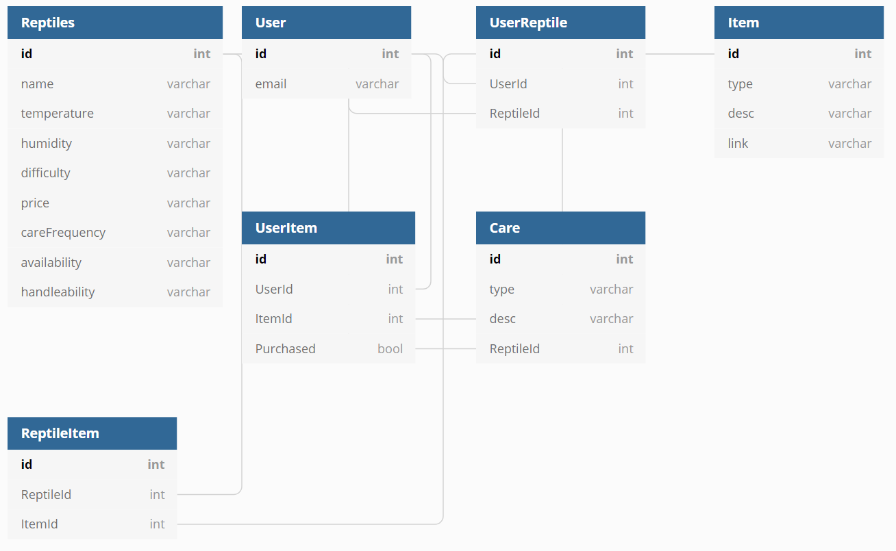

# husbandry
App for beginners interested in reptile/exotic animal husbandry.

1. User registers.
2. User is presented with beginner reptiles and info about them.
3. User can decide on a reptile to care for.
4. User is given a shopping list for their selected reptile.
5. User can check off items on their list that they have purchased.

Future features that I'd like to add:
(after a user has a pet)
- last fed tracking
- enclosure cleaning tracking
- humidity/temp tracking
- weight tracking
- general health tracking

